# FRIENDS サンプルドキュメント

> ダミーコンテンツ。Markdown/Mermaidの表現力検証用。

---

## Markdown記法サンプル

### キャラクター紹介

| 名前 | 演者 | 職業 | 口癖・特徴 |
|---|---|---|---|
| Ross Geller | David Schwimmer | 古生物学者 | "We were on a break!" |
| Rachel Green | Jennifer Aniston | ファッション業界 | 花嫁衣装のまま登場 |
| Monica Geller | Courteney Cox | シェフ | 潔癖症・競争心が強い |
| Chandler Bing | Matthew Perry | データ処理関連(職種不明ネタ) | 皮肉なジョーク |
| Joey Tribbiani | Matt LeBlanc | 俳優志望 | "How you doin?" |
| Phoebe Buffay | Lisa Kudrow | ミュージシャン | "Smelly Cat" |

### シーズン概要表

| シーズン | 話数 | 主な出来事 | IMDb評価(ダミー) |
|---|---|---|---|
| S1 | 24 | Rachelが仲間入り | 8.3 |
| S2 | 24 | Ross & Rachel交際開始 | 8.2 |
| S3 | 25 | "We were on a break!" | 8.2 |
| S5 | 24 | ラスベガス結婚 | 8.5 |
| S7 | 24 | Monica & Chandler結婚式 | 8.5 |
| S10 | 18 | 最終回 | 9.1 |

### 神回ベスト5

1. **S2E14** "The One with the Prom Video"
2. **S3E15/16** "The One with the Ultimate Fighting Champion"
3. **S4E24** "The One with Ross's Wedding"
4. **S5E24** "The One in Vegas"
5. **S10E17/18** "The Last One"

### セントラルパークの常連(入れ子リスト)

- Main 6
  - Ross
  - Rachel
  - Monica
  - Chandler
  - Joey
  - Phoebe
- 準レギュラー
  - Gunther(店長)
  - Janice(Chandlerの元カノ)

### 初心者向け履修チェックリスト

- [x] S1E1 パイロット回を見る
- [x] "We were on a break!" 事件を確認する
- [ ] Monica & Chandlerの結婚式回を見る
- [ ] 最終回まで完走する
- [ ] "Smelly Cat" のフルバージョンを聴く

### 引用・強調表現

> "We were on a break!"
> — Ross Geller
>
> > "You were on a break?? That's not the same thing!"
> > — Rachel Green

**太字**の例: **Ross & Rachel**は本編通しての軸となるカップル。
*斜体*の例: シーズン5のサブタイトルは大抵 *"The One..."* で始まる。
***太字+斜体***の例: ***"We were on a break!"*** は史上最も引用される台詞の一つ。

~~Ross & Rachelは最終的に別れたまま~~ → 実際は最終回で復縁する[^1]。
~~Chandlerの職業は明かされる~~ → 最後まで謎のまま[^2]。

`==ハイライト==`記法の例: ==サンクスギビング回==は歴代シリーズでも屈指の人気エピソード群。

上付き・下付き文字の例: H~2~O のように H2O を表現、あるいは 2^10^ のような指数表現。

### リンク集

- [キャラクター紹介](#キャラクター紹介) へ戻る
- [神回ベスト5](#神回ベスト5) を見る
- [Mermaid図表サンプル](#mermaid図表サンプル) へジャンプ
- 参照リンクの例: [FRIENDS 全体マインドマップ][mindmap-ref]

[mindmap-ref]: #friends-全体マインドマップ

### コードブロック例

```javascript
const catchphrases = [
  "We were on a break!",
  "How you doin?",
  "PIVOT!",
  "Oh. My. God.",
];

function pickCatchphrase() {
  return catchphrases[Math.floor(Math.random() * catchphrases.length)];
}
```

```json
{
  "title": "The Last One",
  "season": 10,
  "episode": [17, 18],
  "isFinale": true
}
```

インラインコード例: `sofa.orange`(セントラルパークの座席指定、もちろん冗談)。差分風の表現例: `- single` → `+ married`。

### 脚注

Chandlerの職業は劇中でほぼ明かされない[^2]。

[^1]: 最終回 "The Last One" にて。
[^2]: 一応 "transponster" というジョークセリフが有名。

---

## Mermaid図表サンプル

### 発散・分析系

#### FRIENDS 全体マインドマップ

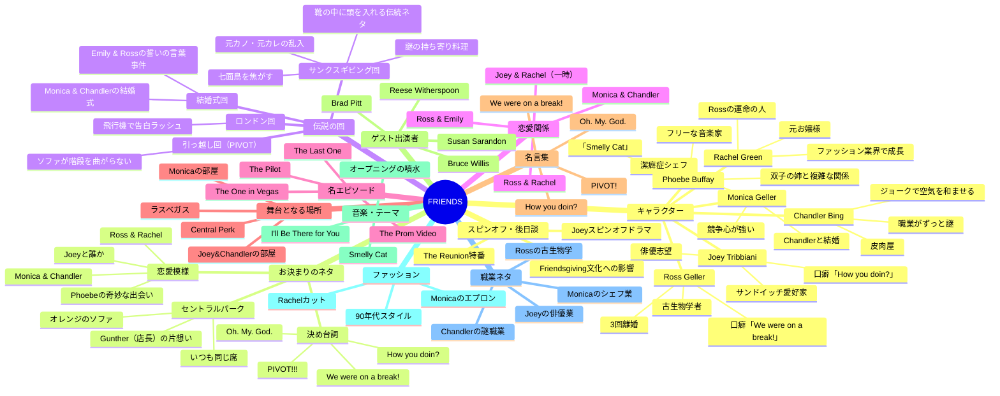

#### シリーズの歩み(timeline)

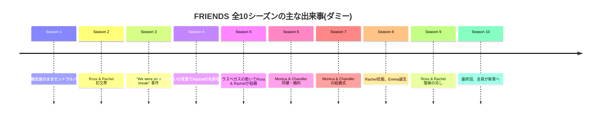

#### Ross & Rachel関係史(gitGraph)

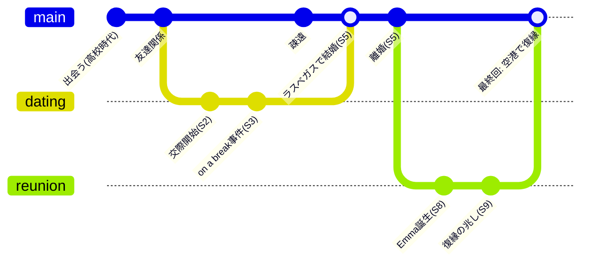

#### キャラクター傾向マップ(quadrantChart)

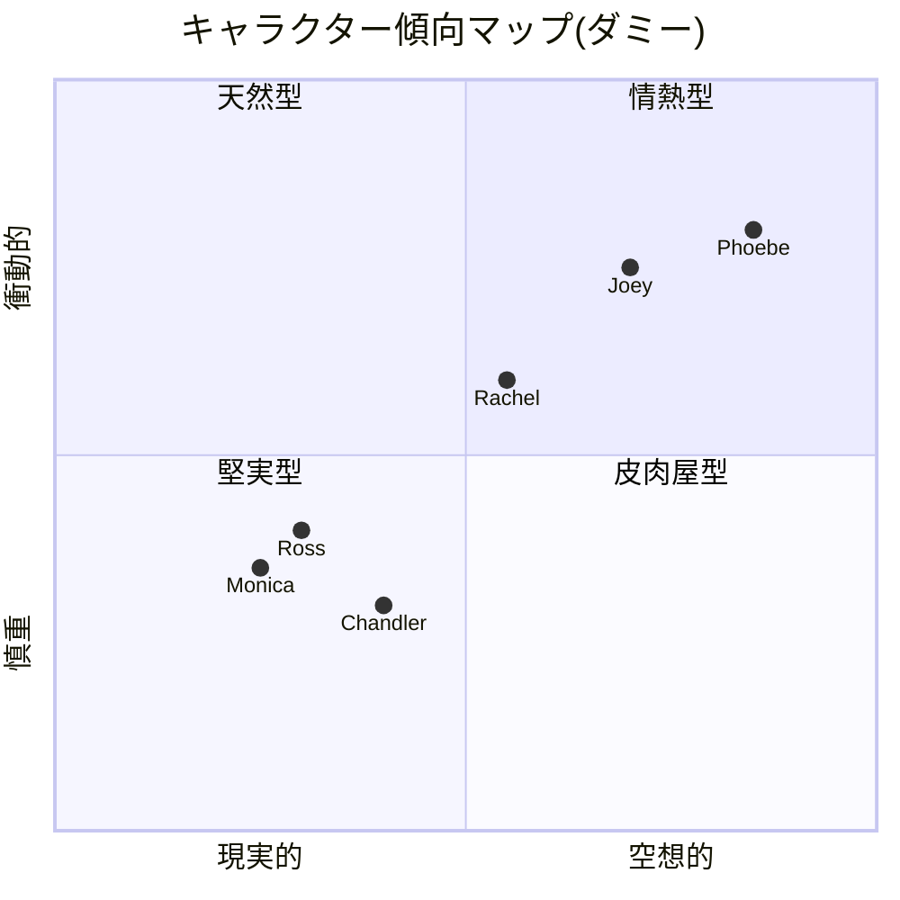

#### 好きなキャラクター投票(pie)

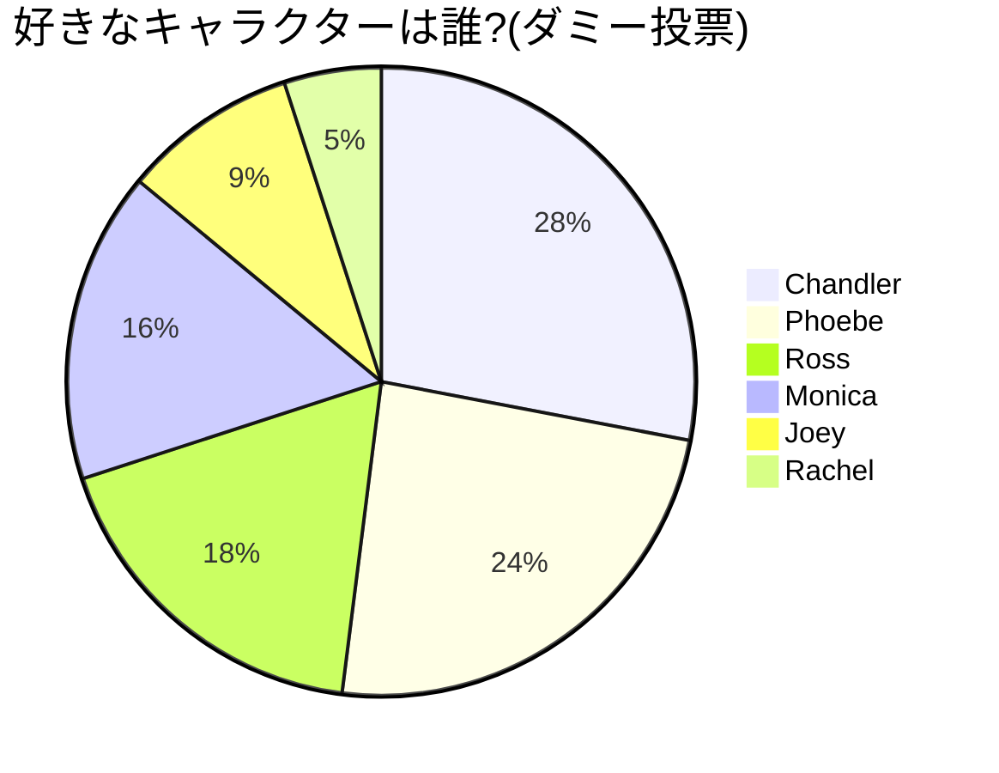

#### サンクスギビング当日のモニカ(journey)

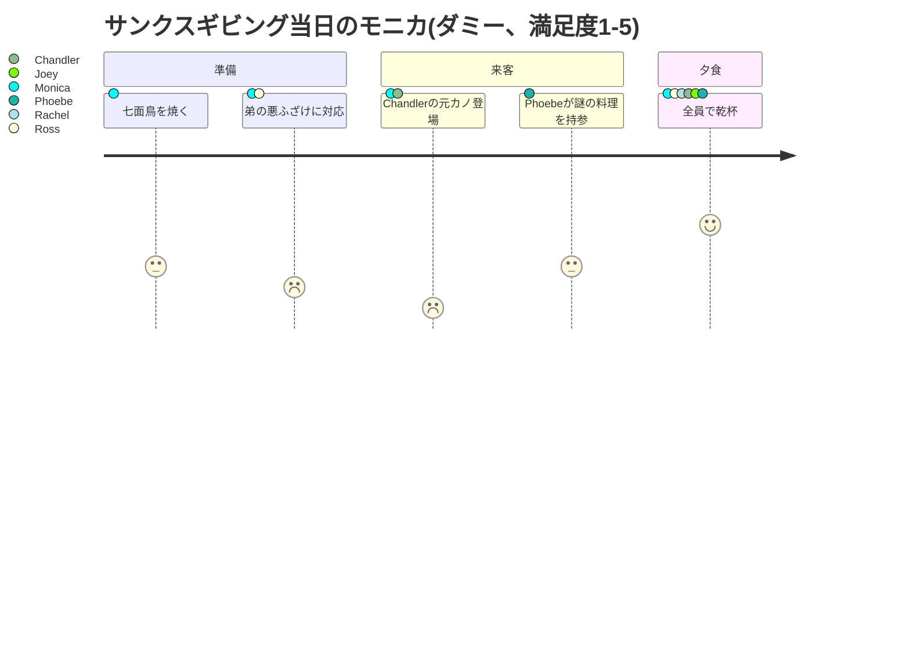

#### キャラクター能力レーダー(radar)

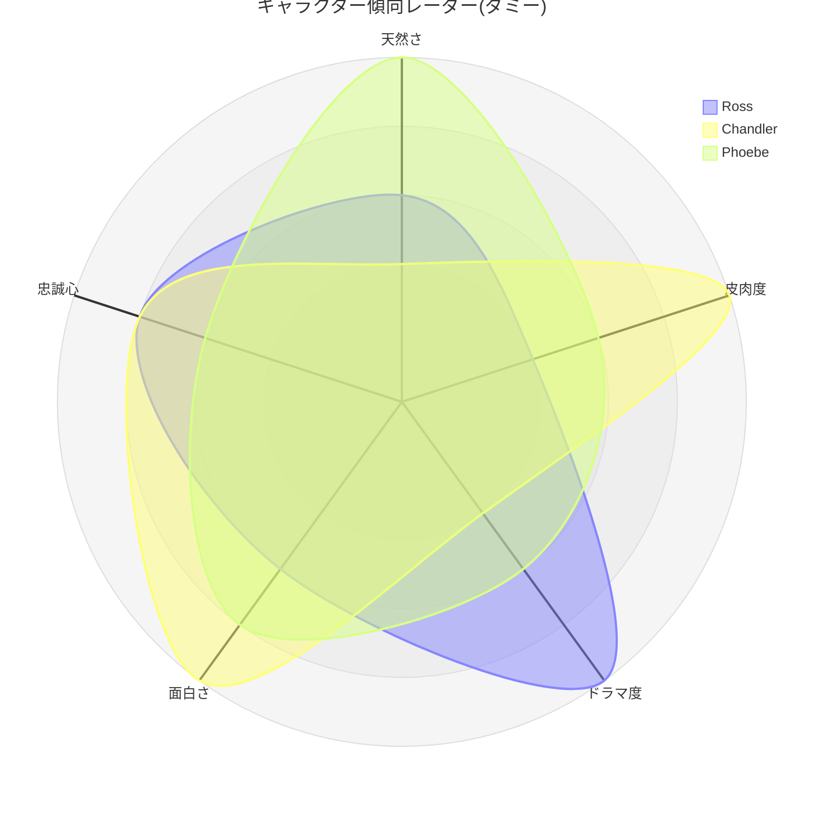

#### 新エピソード制作ボード(kanban)

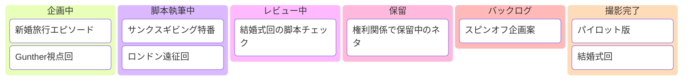

#### シーズン構成比(treemap)

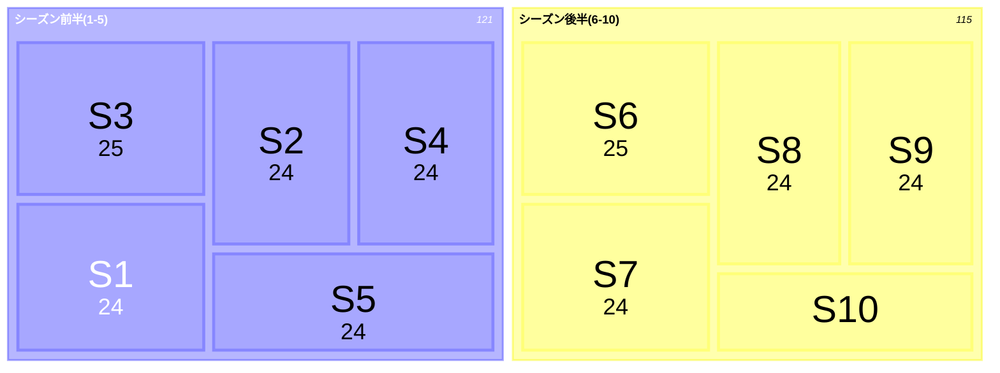

#### ジャンル要素の重なり(venn)

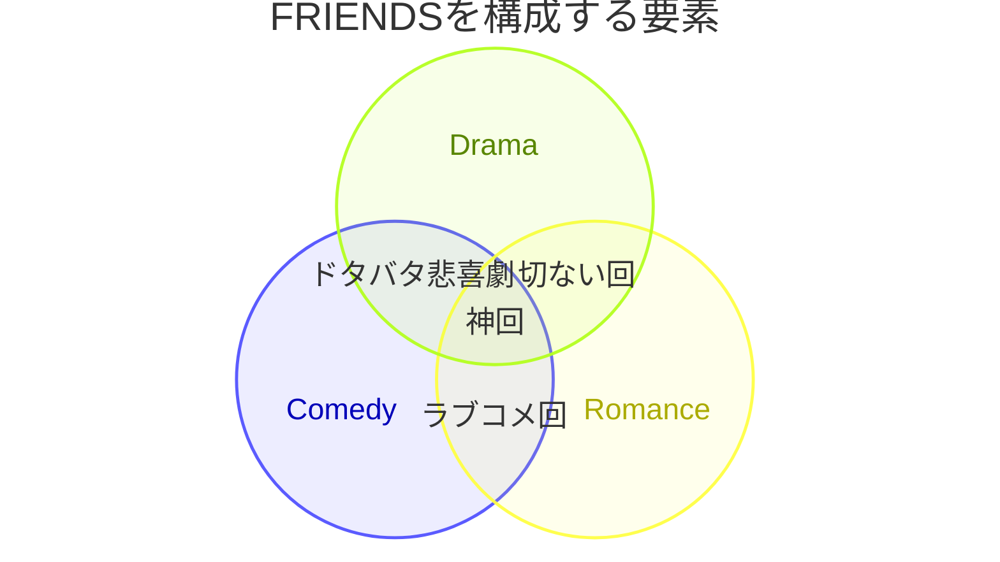

#### Ross&Rachelが すれ違う原因分析(ishikawa)

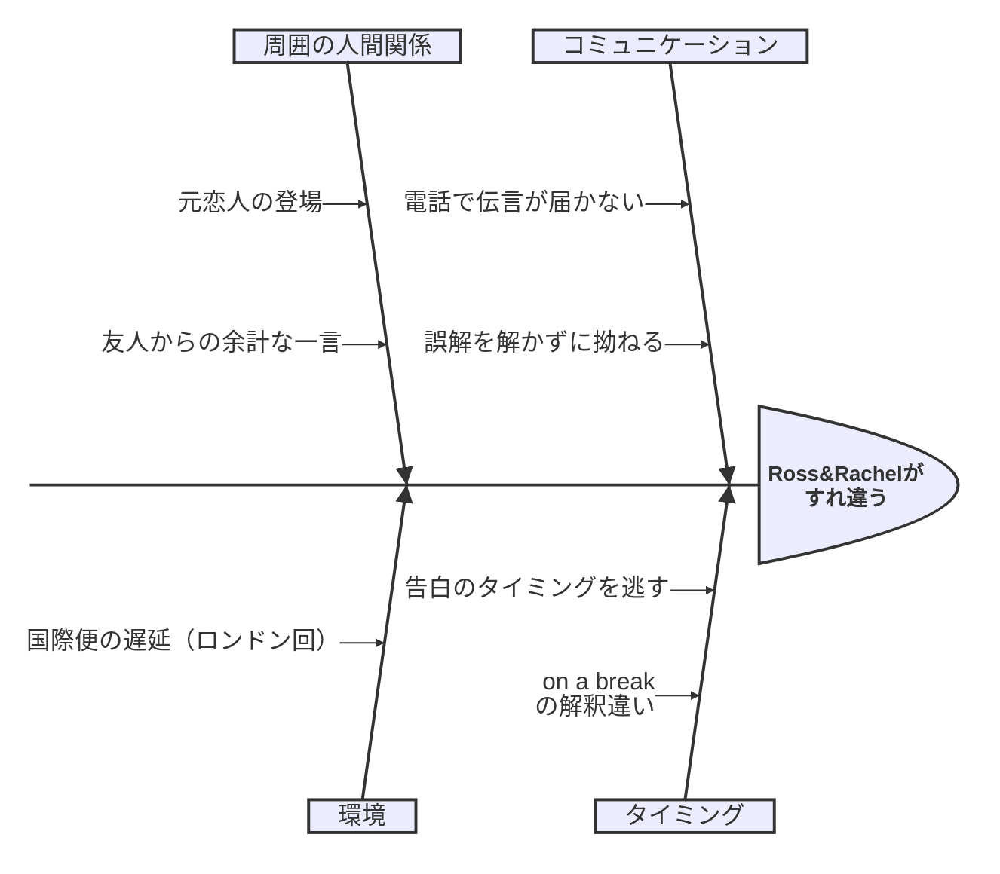

#### セントラルパークの話題の広がり(sankey)

> 日本語非対応(レクサー制限)。対訳: Central Perk Talk=セントラルパークでの会話 / Romance Talk=恋愛トーク / Work Complaints=仕事の愚痴 / Small Talk=雑談 / Ross & Rachel=Ross&Rachelネタ / Monica & Chandler=Monica&Chandlerネタ / Joey's Flings=Joeyの浮気性ネタ

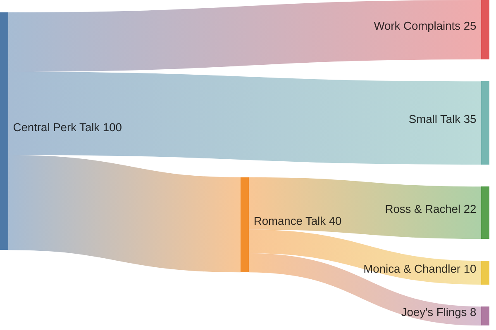

#### シーズン別 IMDb評価の推移(xychart)

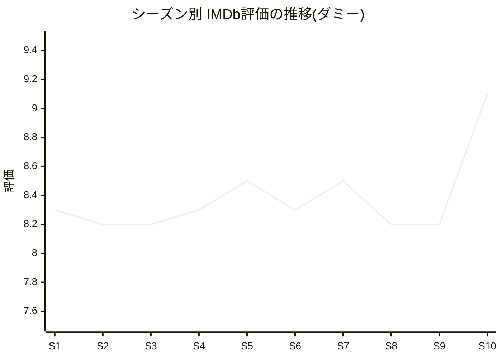

#### 脚本ファイル構成(treeView)

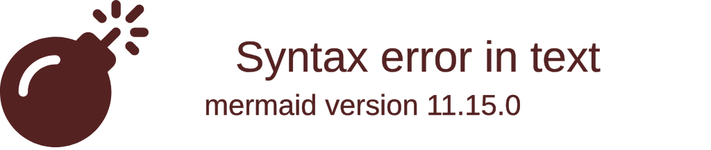

#### トラブル対応の分類(cynefin)

```mermaid
cynefin-beta
  title シットコム的トラブルの分類(ダミー)

  complex
    "Ross&Rachelの関係修復"

  complicated
    "サンクスギビング料理の采配"

  clear
    "家賃の割り勘ルール"

  chaotic
    "結婚式当日のアクシデント"

  confusion
    "Chandlerの職業を説明する"
```

#### Central Perk 戦略マップ(wardley)

```mermaid
wardley-beta
title Central Perk 提供価値マップ(ダミー)
component "コーヒー" [0.9, 0.9]
component "常連との会話" [0.7, 0.4]
component "オレンジのソファ" [0.5, 0.2]
"コーヒー" -> "常連との会話"
```

#### Rachel仲間入りイベント(eventmodeling)

> 日本語非対応(識別子はASCII必須)。対訳: CentralPerkVisit=セントラルパーク来店 / SitInWeddingDress=花嫁衣装のまま座る / RachelJoinedTheGroup=Rachelが仲間入りした

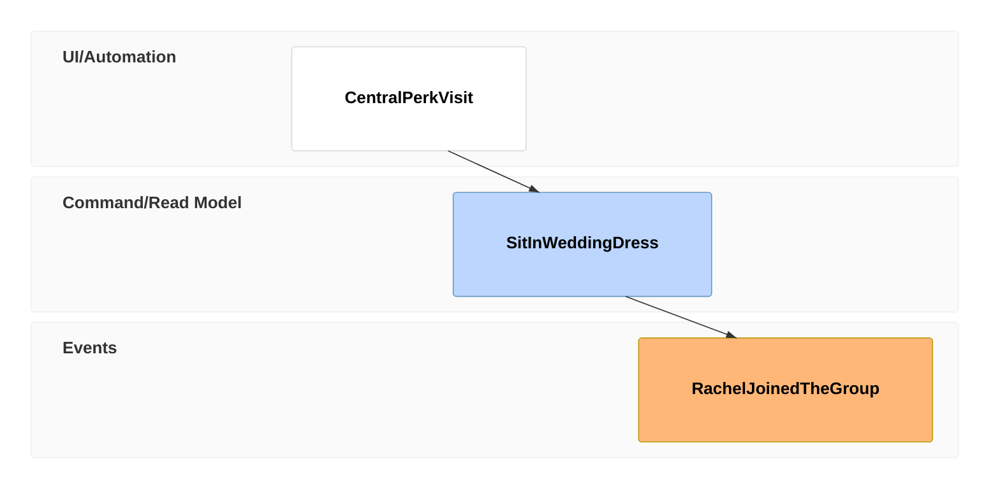

### モデル図(必要最小限)

#### 典型的な1エピソードの流れ(flowchart)

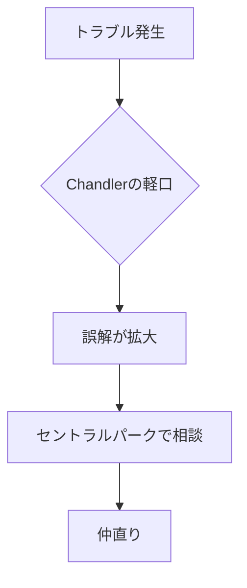

#### 留守電ネタ(sequenceDiagram)

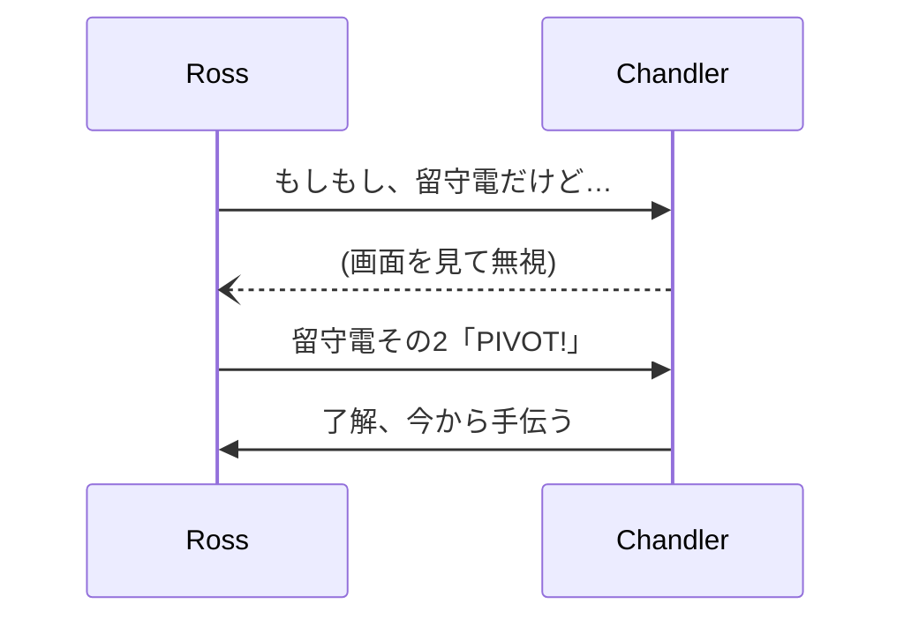

#### キャラクタークラス(classDiagram)

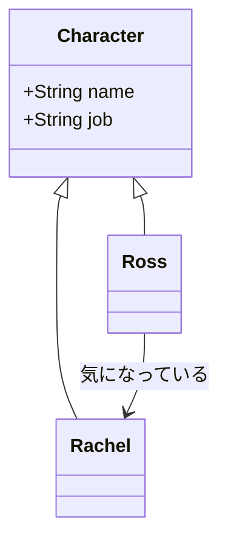

#### 交際ステータス(stateDiagram)

```mermaid
stateDiagram-v2
    [*] --> 友達
    友達 --> 交際中
    交際中 --> 破局
    破局 --> 交際中 : 復縁
    交際中 --> [*]
```

#### 登場人物とエピソード(ER図)

```mermaid
erDiagram
    CHARACTER ||--o{ EPISODE : appears_in
    CHARACTER {
      string name
      string job
    }
    EPISODE {
      string title
      int season
    }
```

#### 視聴要件(requirementDiagram)

```mermaid
requirementDiagram

requirement view_requirement {
id: 1
text: "各話にCentral Perkのシーンを含む"
risk: Low
verifymethod: Inspection
}

element script {
type: document
}

script - satisfies -> view_requirement
```

#### システムコンテキスト(C4)

```mermaid
C4Context
  title Central Perk 常連ネットワーク(ダミー)
  Person(customer, "常連客", "コーヒーを飲みに来る")
  Person(regular, "常連客B", "顔なじみの別の常連")
  Person(barista, "Gunther", "コーヒーを提供する店員")
  System(centralPerk, "Central Perk", "コーヒーを提供するカフェ")
  System_Ext(supplier, "豆の卸業者", "コーヒー豆を卸す取引先")
  Rel(customer, centralPerk, "利用する")
  Rel(regular, centralPerk, "利用する")
  Rel(barista, centralPerk, "働く")
  Rel(centralPerk, supplier, "仕入れる")
```

#### 住居アーキテクチャ(architecture)

```mermaid
architecture-beta
    group building(cloud)[アパート]
    service monica(server)[Monicaの部屋] in building
    service joey(server)[Joeyの部屋] in building
    monica:R --> L:joey
```

#### 部屋割りブロック図(block)

```mermaid
block
  columns 3
  block:monicaApt
    columns 2
    livingroom["リビング"]
    kitchen["キッチン"]
    sofa(("オレンジのソファ"))
    purpleDoor{{"紫のドア"}}
  end
  hallway["廊下"]
  block:joeyApt
    columns 2
    tv["大きすぎるTV"]
    barcalounger(("バカラウンジャーx2"))
    foosball["フットボール台"]
    entertainmentCenter["エンタメセンター争奪戦"]
  end
  monicaApt --> hallway
  hallway --> joeyApt
```

#### 留守電パケット構造(packet)

```mermaid
packet
0-7: "Season"
8-15: "Episode"
16-31: "RunningGag"
```

#### 仲直りスイムレーン(swimlanes)

```mermaid
swimlane-beta LR
  subgraph Ross["Ross"]
    ross_call[電話をかける]
  end
  subgraph Chandler["Chandler"]
    ignore[留守電を無視する]
    help[結局手伝う]
  end
  ross_call --> ignore
  ignore --> help
```

#### 留守電ZenUML(zenuml)

```mermaid
zenuml
Ross->Chandler: 留守電を残す
Chandler-->Ross: 既読無視
```

#### Season1 撮影スケジュール(gantt)

```mermaid
gantt
    title Season 1 撮影スケジュール(ダミー)
    dateFormat YYYY-MM-DD
    section 準備
    脚本準備          :a1, 2024-01-01, 10d
    キャスティング     :a2, after a1, 5d
    section 撮影
    パイロット撮影     :a3, after a2, 7d
    通常話 撮影        :a4, after a3, 60d
    section 仕上げ
    編集・音入れ       :a5, after a4, 20d
```
